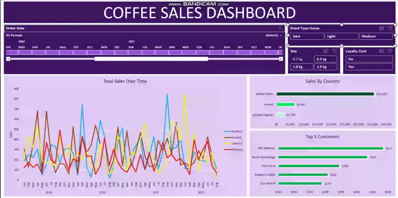

# ☕ Coffee Sales Dashboard (Excel)

This repository showcases an interactive **Coffee Sales Dashboard** built using **Microsoft Excel**. The dashboard provides insights into sales performance, customer behavior, and product trends, enabling users to analyze data effectively through various filters and visualizations.

---

## 🚀 Project Overview

The Coffee Sales Dashboard is designed to help a coffee business understand its sales data at a glance. It consolidates information from multiple datasets (orders, customers, and products) into a single, dynamic interface. Key metrics and trends are visualized through charts and tables, allowing for quick identification of top-performing products, customer segments, and sales patterns over time.

---

## ✨ Features

- **Dynamic Date Filtering**  
  Analyze sales data across different time periods using an interactive date slicer.

- **Product Segmentation**  
  Filter sales by Roast Type and Size to understand product popularity.

- **Customer Loyalty Analysis**  
  Segment data based on whether customers have a loyalty card.

- **Sales Over Time Chart**  
  Visualize sales trends over months and years.

- **Sales by Country**  
  Understand geographical sales distribution.

- **Top 5 Customers**  
  Identify the most valuable customers based on their purchasing activity.

---

## 📊 Data Sources

The dashboard is built upon data extracted from the following CSV files:

- `coffeeOrdersData.xlsx - orders.csv`:  
  Contains detailed information about each order, including Order ID, Order Date, Customer ID, Product ID, and Quantity.

- `coffeeOrdersProject.xlsx - customers.csv`:  
  Cleaned data set and the project dashboard

---

## 💡 What I Learned

This project was a comprehensive learning experience in data manipulation, analysis, and visualization using Excel. Below are some of the key functions and techniques I mastered:

### 🔍 XLOOKUP

- **Purpose:** Modern and powerful alternative to VLOOKUP/HLOOKUP for looking up values in any direction.
- **Application:** Used to retrieve customer names, coffee types, unit prices, and related data based on IDs.

### 🧩 INDEX & MATCH

- **Purpose:** Useful for complex lookups and returning values from non-adjacent columns.
- **Application:** Practiced to understand multi-criteria lookup logic and flexibility over XLOOKUP.

### ✅ IF / IFS

- **IF:** Used for simple true/false conditions (e.g., loyalty card = "Yes"/"No").
- **IFS:** Used for multiple condition checks (e.g., profit margins, sales tiers).

### 🧹 Remove Duplicates

- **Purpose:** Ensured unique records in datasets before performing lookups and aggregations.

### 📐 Convert to Table

- **Purpose:** Transformed cleaned data into structured Excel Tables for better formatting, filtering, and pivot integration.
- **Benefits:**
  - Structured references (e.g., `Table1[Unit Price]`)
  - Auto-expansion
  - Enhanced compatibility with PivotTables and Charts
  - Built-in filtering and validation

---

## 📸 Screenshots & GIF

Here's a quick look at the dashboard in action:

## 

## 🛠️ How to Use

1. **Download the Excel file**  
   `coffeeOrdersProject.xlsx - customers.csv`:

2. **Ensure Data is Linked**  
   Check that `orders.csv`, `customers.csv`, and `products.csv` data is loaded or linked properly in the Excel workbook.

3. **Interact with Slicers**  
   Use filters like:

   - **Order Date**
   - **Roast Type Name**
   - **Size**
   - **Loyalty Card**  
     to dynamically update dashboard views.

4. **Explore Visuals**  
   Analyze:
   - **Total Sales Over Time**
   - **Sales by Country**
   - **Top 5 Customers**  
     for actionable insights.

---
